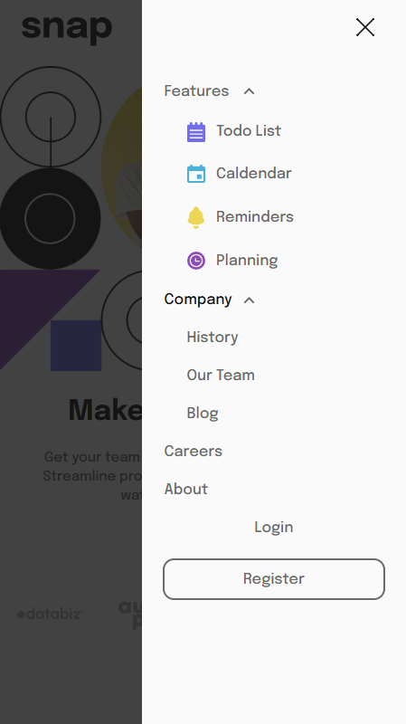

# Frontend Mentor - Intro section with dropdown navigation solution

This is a solution to the [Intro section with dropdown navigation challenge on Frontend Mentor](https://www.frontendmentor.io/challenges/intro-section-with-dropdown-navigation-ryaPetHE5). Frontend Mentor challenges help you improve your coding skills by building realistic projects.

## Table of contents

-   [Overview](#overview)
    -   [The challenge](#the-challenge)
    -   [Screenshot](#screenshot)
    -   [Links](#links)
-   [My process](#my-process)
    -   [Built with](#built-with)
-   [Author](#author)

## Overview

### The challenge

Users should be able to:

-   View the relevant dropdown menus on desktop and mobile when interacting with the navigation links
-   View the optimal layout for the content depending on their device's screen size
-   See hover states for all interactive elements on the page

### Screenshot

Desktop view

Mobile view

### Links

-   Live Site URL:

## My process

### Built with

-   HTML5
-   CSS3
-   JavaScript
-   Flexbox
-   Mobile-first workflow
-   [Font: Epilogue from Google Fonts](https://fonts.google.com/specimen/Epilogue)

## Author

-   Website - [DDM-projects](https://github.com/DDM-projects)
